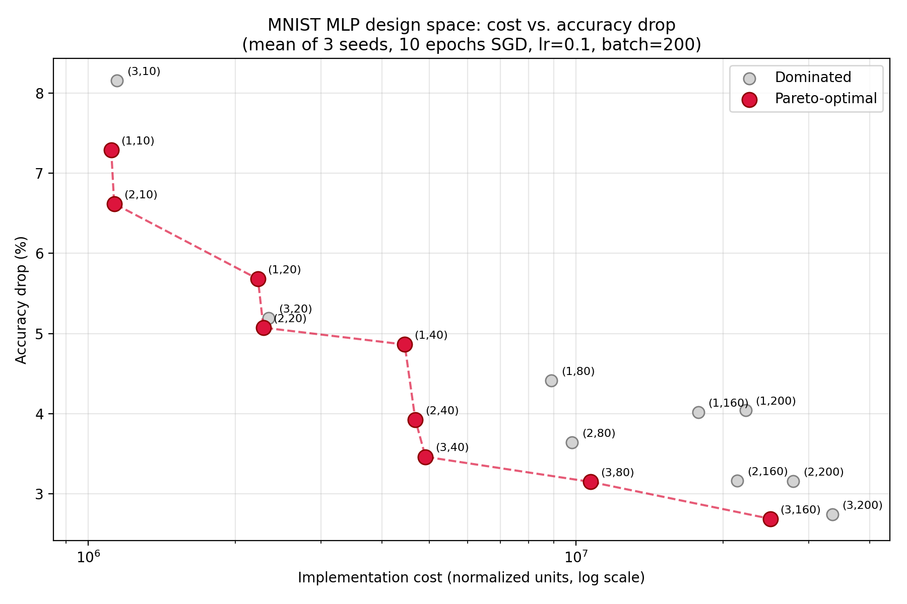

# ELCT918 – Lab Assignment 1
## Multi-Objective Design Space Exploration of Neural Network Hyper-Parameters

This project generates fully-connected neural networks (MLPs) from two parameters, trains each one on MNIST, and finds the Pareto-optimal trade-off between implementation cost and accuracy drop.

**Framework:** PyTorch

## Files

| File | Contents |
|---|---|
| `dse_mnist.py` | Full pipeline: network generator, MNIST training/evaluation, cost model, Pareto front, plot |
| `pareto_front.png` | Cost vs. accuracy-drop plot with the Pareto-optimal front highlighted |
| `results.csv` | One row per configuration (mean over 3 seeds), with a `pareto` column |
| `runs_raw.csv` | Every individual training run (18 configurations × 3 seeds) |

## How to run

**Google Colab (recommended):** set *Runtime → Change runtime type → T4 GPU*, upload `dse_mnist.py`, then run:

```
!python dse_mnist.py
```

**Locally:**

```
pip install torch torchvision pandas matplotlib
python dse_mnist.py
```

MNIST downloads automatically on the first run. The full sweep takes about 4 minutes on a T4 GPU. It also runs on CPU, but more slowly.

## Dependencies

Python 3.9+, `torch`, `torchvision`, `pandas`, `matplotlib`.

## Method

| Setting | Value |
|---|---|
| Hidden layers (n) | 1, 2, 3 |
| Nodes per hidden layer (m) | 10, 20, 40, 80, 160, 200 (same m in every layer) |
| Configurations | 18, all trained (exhaustive search) |
| Training | SGD, learning rate 0.1, batch size 200, 10 epochs, cross-entropy loss, ReLU |
| Repeats | 3 seeds per configuration, results averaged |
| Cost | (weights × 139) + (multiplications × 1), from the reference paper's normalized 32-bit energy costs |
| Accuracy drop | 100% − test accuracy (%) |

## Result

9 of the 18 configurations are Pareto-optimal. The knee of the front is **(n=3, m=40)**: 96.54% test accuracy at a cost of 4.9M. Wide single-layer networks are all dominated. For example, (1, 200) costs 4.5× more than (3, 40) and is less accurate.



## Reference

Smithson, S. C., Yang, G., Gross, W. J., & Meyer, B. H. (2016). *Neural Networks Designing Neural Networks: Multi-Objective Hyper-Parameter Optimization.* ICCAD 2016.
